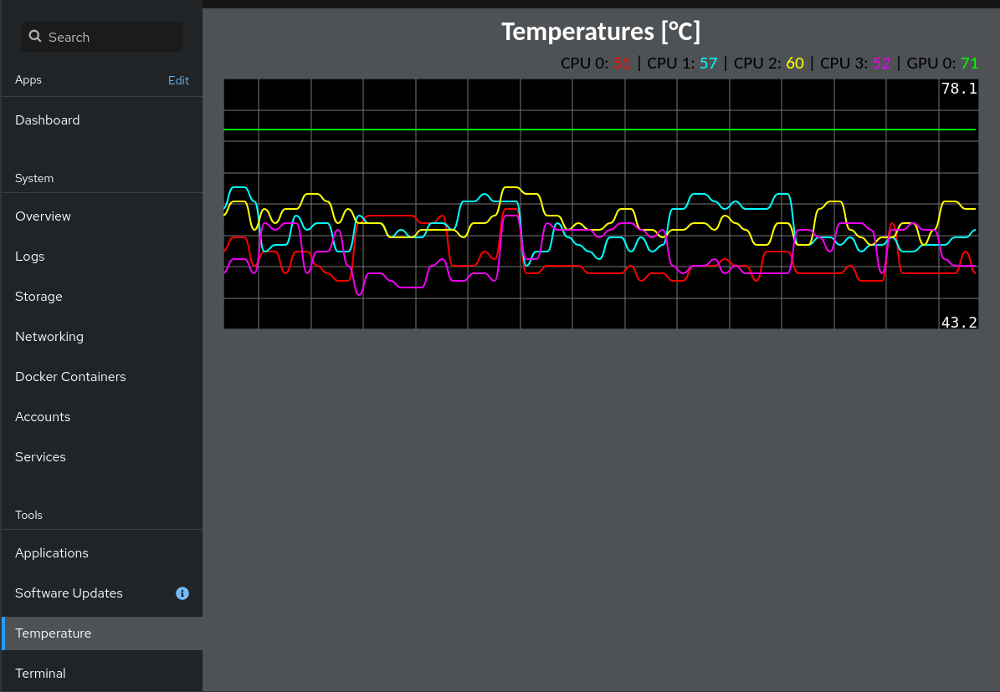

# cockpit-temperature-plugin
Cockpit Temperature Plugin using [smoothie-charts](http://smoothiecharts.org)

Re-mixed to show temperatures from multiple CPU cores as well as a GPU.

To intall, as described in [Cockpit docs](https://cockpit-project.org/blog/creating-plugins-for-the-cockpit-user-interface.html) simply put the files in ```/usr/share/cockpit``` for the plugin to be available for all system useres **or** in a spesific user folder under ```~/.local/share/cockpit```

screenshots:


